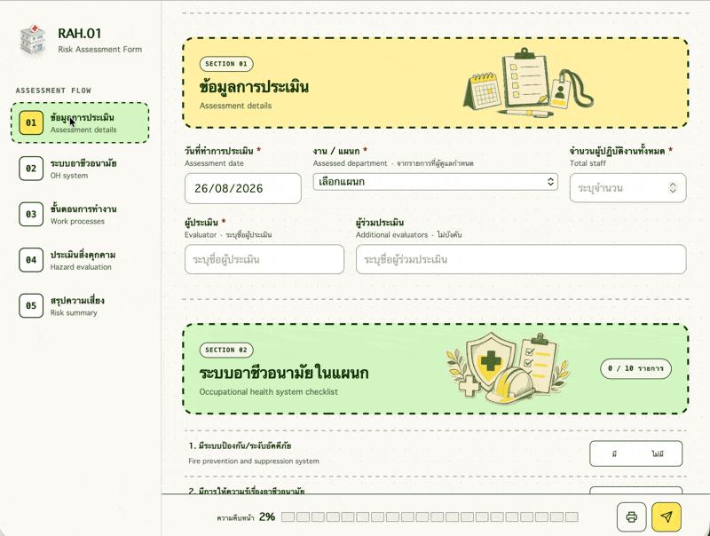

# [OpenRAH.01](https://taewat07.github.io/OpenRAH.01/)

- เบื่อไหมกับใช้ Google Form สร้างแบบสอบถามได้ไม่ถูกใจ ?!
- OpenRAH.01 เป็นโครงการโอเพนซอร์สออกแบบประเมินความเสี่ยงทางสุขภาพจากการทำงาน RAH.01 มาใช้ในโรงพยาบาลประเทศไทย
- หน่วยงานกรอกข้อมูลผ่านแบบฟอร์มออนไลน์ → ระบบส่งข้อมูลไปเก็บใน Google Sheets ส่วนตัว
- มี Template Google Sheets พร้อมใช้งาน เก็บข้อมูลเป็นระบบและมี Dashboard สำเร็จรูป

ระบบใช้เครื่องมือของ Google ที่โรงพยาบาลมีอยู่แล้ว จึงไม่ต้องตั้งเซิร์ฟเวอร์หรือฐานข้อมูลเพิ่ม

## ตัวอย่างฟอร์ม RAH.01 ออนไลน์



## ความสามารถของระบบ

- แบบประเมิน RAH.01 สองภาษา แบ่งเป็น 5 ส่วน
- ตั้งชื่อโรงพยาบาลและรายการแผนกจาก Google Sheets ได้
- แอปไม่กำหนดเพดานจำนวนแผนก โดย template เตรียมไว้ 150 แถว: เปิดใช้งาน 70 แผนกแรกและมีแถวสำรองแบบ inactive อีก 80 แผนก
- เพิ่มขั้นตอนการทำงานและรายการสิ่งคุกคามได้ตามข้อมูลจริงของแต่ละแผนก
- แยกการพบสิ่งคุกคามออกจากการมีผู้สัมผัส เพื่อข้ามการให้คะแนนได้เมื่อพบสิ่งคุกคามแต่ไม่มีคนสัมผัส
- คำนวณคะแนนความเสี่ยง A × B และจัดระดับ ต่ำ ปานกลาง หรือสูงให้อัตโนมัติ
- แนบรูปหลักฐานและเก็บไว้ในโฟลเดอร์ Google Drive แบบส่วนตัว
- ตารางฐานข้อมูลแสดงชื่อแผนกและหัวข้อที่อ่านเข้าใจได้ ไม่ต้องไล่เทียบรหัส
- มีหน้าแดชบอร์ดสำหรับผู้ดูแลระบบ สถานะงาน และประวัติการดำเนินการ
- ป้องกันการบันทึกซ้ำ พร้อมตรวจสอบข้อมูลอีกครั้งที่ฝั่งเซิร์ฟเวอร์
- ไม่ต้องซื้อระบบหลังบ้านหรือฐานข้อมูลภายนอกเพิ่ม

## โครงสร้างระบบ

```text
แบบฟอร์มในเว็บเบราว์เซอร์
    ↓
เว็บแอป Google Apps Script
    ↓
ฐานข้อมูล Google Sheets + รูปแนบใน Google Drive แบบส่วนตัว
```

Google Sheets Template มี 8 แท็บสำเร็จรูป:

1. `01 assessment`
2. `02 OH system`
3. `03 work process`
4. `04 Hazards`
5. `Attachments`
6. `AdminLog`
7. `Settings`
8. `Admin Dashboard`

## [วิธีติดตั้ง](https://taewat07.github.io/OpenRAH.01/setup.html)

```
OpenRAH.01-main/
├── RAH01_Template.xlsx <--- อัปโหลดลง Google Sheets (1)
└── AppsScript/
    ├── Code.gs         ┐
    ├── Config.gs       │
    ├── Dictionaries.gs │
    ├── Storage.gs      │
    ├── Submission.gs   ├<--- อัปโหลดลง Apps Script (2)
    ├── Index.html      │
    ├── Styles.html     │
    ├── Scripts.html    │
    └── appsscript.json ┘
```

1. อัปโหลด `RAH01_Template.xlsx` ไปยัง Google Drive เปิดด้วย Google Sheets แล้วเลือก **ไฟล์ → บันทึกเป็น Google ชีต** เพื่อสร้างไฟล์ Google Sheets แบบ native
2. เปิดแท็บ `Admin Dashboard` ในไฟล์ที่แปลงแล้ว แดชบอร์ดที่สร้างไว้ล่วงหน้าจะแสดงและใช้งานได้ทันที ไม่ต้องรันสคริปต์เพื่อให้แดชบอร์ดปรากฏ
   - `Total Hazards Identified by Category`
   - `Risk Assessment Progress Across Departments`
   - `Top 10 High-Risk Departments`
3. เปิดเมนู **ส่วนขยาย → Apps Script**
4. สร้างไฟล์ในโครงการ Apps Script แล้วคัดลอกเนื้อหาจากโฟลเดอร์ `AppsScript/` ไปวางให้ตรงกับชื่อไฟล์
5. เลือกฟังก์ชัน `setupRah01Production` กด Run หนึ่งครั้ง และอนุญาตสิทธิ์ที่ระบบร้องขอ ขั้นตอนนี้ยังจำเป็นหนึ่งครั้งเพื่อติดตั้งโครงสร้างจัดเก็บ ขอสิทธิ์ Google Sheets/Drive และตรวจซ่อมสูตรกับกราฟให้เป็น Google Sheets แบบ native ไม่ใช่เพื่อทำให้แดชบอร์ดเริ่มแสดง
6. ใช้ไฟล์ Google Sheets ที่แปลงแล้วเป็นไฟล์ฐานข้อมูลต่อไป ไม่ต้องอัปโหลดไฟล์ Excel ที่มีแดชบอร์ดซ้ำอีก
7. เปิดแท็บ `Settings` แล้วเปลี่ยนค่า `hospital_name` ในช่องสีเหลืองเป็นชื่อโรงพยาบาล
8. ตรวจรายการเริ่มต้น 150 แผนกในแท็บ `Settings` โดย 70 แผนกแรกเป็น active ส่วนอีก 80 แถวเป็นแผนกสำรองแบบ inactive หากต้องการมากกว่านี้ ให้เพิ่มแถวต่อท้ายตาราง แล้วกำหนดชื่อ รหัส สถานะ ลำดับ และ ID โดยห้ามซ้ำกับแถวเดิม
9. เรียกใช้ `clearBundledSyntheticData` เพื่อลบข้อมูลตัวอย่างก่อนเริ่มรับข้อมูลจริง
10. Deploy โครงการ Apps Script เป็น Web app และจำกัดผู้ใช้ให้อยู่ในโดเมน Google Workspace ของโรงพยาบาล
11. ทดลองส่งแบบประเมินหนึ่งรายการ แล้วตรวจข้อมูลในทุกแท็บรวมถึงโฟลเดอร์เก็บรูปแนบ

อ่านขั้นตอนแบบละเอียดได้ที่ [`AppsScript/README.md`](AppsScript/README.md)

## การตั้งค่าที่ผู้ดูแลแก้เองได้

ผู้ดูแลโรงพยาบาลตั้งค่าระบบจากแท็บ `Settings` ได้โดยไม่ต้องแก้โค้ด:

- `Settings!H4` กำหนดชื่อโรงพยาบาลที่แสดงบนแบบฟอร์ม
- `tblDepartments` กำหนดชื่อแผนก รหัส สถานะเปิดใช้งาน และลำดับการแสดงผล
- ข้อมูลที่ส่งแล้วจะเก็บชื่อแผนก ณ วันที่ประเมินไว้ แม้ภายหลังผู้ดูแลจะเปลี่ยนชื่อแผนกใน `Settings`

## การดูแลข้อมูล

OpenRAH01 ใช้เก็บข้อมูลการประเมินด้านอาชีวอนามัย ก่อนเปิดใช้งานจริง โรงพยาบาลควรจัดการสิทธิ์และข้อมูลดังนี้:

- อนุญาตให้เฉพาะบุคลากรของโรงพยาบาลเข้าใช้เว็บแอป
- จำกัดสิทธิ์ Google Sheets และโฟลเดอร์รูปแนบเฉพาะผู้เกี่ยวข้อง
- ไม่บันทึกข้อมูลที่ระบุตัวผู้ป่วยได้
- แยกสิทธิ์ผู้ดูแลระบบออกจากผู้กรอกแบบประเมินทั่วไป
- ปฏิบัติตามนโยบายของโรงพยาบาลและกฎหมายคุ้มครองข้อมูลที่เกี่ยวข้อง
- ทดลองระบบด้วยข้อมูลที่ไม่เป็นความลับก่อนเปิดใช้งานจริง

โครงการนี้เป็นเครื่องมือช่วยจัดเก็บและทบทวนแบบประเมิน ไม่ใช่คำแนะนำทางการแพทย์หรือกฎหมาย

## ไฟล์สำคัญในโปรเจค

- `rah01-form.html` แบบฟอร์มต้นฉบับสำหรับพัฒนาและเปิดดูในเครื่อง
- `RAH01_Template.xlsx` template ข้อมูลสำหรับนำเข้า Google Sheets
- `AppsScript/` ระบบหลังบ้านและเว็บแอปที่เตรียมไว้สำหรับคัดลอกเข้า Apps Script
- `assets/` ไฟล์รูปแบบการแสดงผล สคริปต์ ไอคอน และภาพประกอบของแต่ละส่วน

## สัญญาอนุญาต

เผยแพร่ภายใต้ [MIT License](LICENSE)
