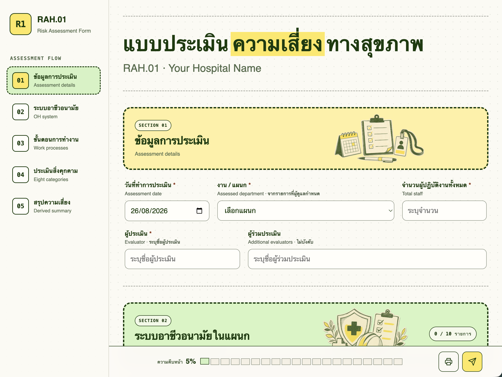

# OpenRAH01

OpenRAH01 เป็นโครงการโอเพนซอร์สสำหรับนำแบบประเมินความเสี่ยงทางสุขภาพจากการทำงาน RAH.01 มาใช้ในโรงพยาบาล บุคลากรกรอกข้อมูลผ่านแบบฟอร์มบนเว็บ ระบบส่งข้อมูลไปเก็บใน Google Sheets ด้วย Apps Script ส่วนผู้ดูแลระบบสามารถตรวจผลโดยค้นหาและกรองตามชื่อแผนกได้ทันที

ระบบใช้เครื่องมือของ Google ที่โรงพยาบาลมีอยู่แล้ว จึงไม่ต้องตั้งเซิร์ฟเวอร์หรือฐานข้อมูลเพิ่ม

## ตัวอย่างหน้าจอ



## ความสามารถของระบบ

- แบบประเมิน RAH.01 สองภาษา แบ่งเป็น 5 ส่วน
- ตั้งชื่อโรงพยาบาลและรายการแผนกจาก Google Sheets ได้
- รองรับแผนกในโรงพยาบาลได้สูงสุด 70 แผนก
- เพิ่มขั้นตอนการทำงานและรายการสิ่งคุกคามได้ตามข้อมูลจริงของแต่ละแผนก
- คำนวณคะแนนความเสี่ยง A × B และจัดระดับ ต่ำ ปานกลาง หรือสูงให้อัตโนมัติ
- แนบรูปหลักฐานและเก็บไว้ในโฟลเดอร์ Google Drive แบบส่วนตัว
- ตารางฐานข้อมูลแสดงชื่อแผนกและหัวข้อที่อ่านเข้าใจได้ ไม่ต้องไล่เทียบรหัส
- มีหน้าแดชบอร์ดสำหรับผู้ดูแลระบบ สถานะงาน และประวัติการดำเนินการ
- ป้องกันการบันทึกซ้ำ พร้อมตรวจสอบข้อมูลอีกครั้งที่ฝั่งเซิร์ฟเวอร์
- ไม่ต้องซื้อระบบหลังบ้านหรือฐานข้อมูลภายนอกเพิ่ม

## โครงสร้างระบบ

```text
แบบฟอร์มในเว็บเบราว์เซอร์
    ↓
เว็บแอป Google Apps Script
    ↓
ฐานข้อมูล Google Sheets + รูปแนบใน Google Drive แบบส่วนตัว
```

ไฟล์ฐานข้อมูลมี 8 แท็บ:

1. `01 assessment`
2. `02 OH system`
3. `03 work process`
4. `04 Hazards`
5. `Attachments`
6. `AdminLog`
7. `Settings`
8. `Admin Dashboard`

## วิธีติดตั้ง

1. อัปโหลด `RAH01_Template.xlsx` ไปยัง Google Drive แล้วเปิดเป็น Google Sheets
2. เปิดเมนู **ส่วนขยาย → Apps Script**
3. สร้างไฟล์ในโครงการ Apps Script แล้วคัดลอกเนื้อหาจากโฟลเดอร์ `AppsScript/` ไปวางให้ตรงกับชื่อไฟล์
4. เลือกฟังก์ชัน `setupRah01Production` กด Run หนึ่งครั้ง และอนุญาตสิทธิ์ที่ระบบร้องขอ
5. เปิดแท็บ `Settings` แล้วเปลี่ยนค่า `hospital_name` ในช่องสีเหลืองเป็นชื่อโรงพยาบาล
6. ตรวจรายการ 70 แผนก จากนั้นแก้ชื่อ รหัส สถานะ และลำดับการแสดงผลให้ตรงกับโรงพยาบาล
7. เรียกใช้ `clearBundledSyntheticData` เพื่อลบข้อมูลตัวอย่างก่อนเริ่มรับข้อมูลจริง
8. Deploy โครงการ Apps Script เป็น Web app และจำกัดผู้ใช้ให้อยู่ในโดเมน Google Workspace ของโรงพยาบาล
9. ทดลองส่งแบบประเมินหนึ่งรายการ แล้วตรวจข้อมูลในทุกแท็บรวมถึงโฟลเดอร์เก็บรูปแนบ

อ่านขั้นตอนแบบละเอียดได้ที่ [`AppsScript/README.md`](AppsScript/README.md)

## การตั้งค่าที่ผู้ดูแลแก้เองได้

ผู้ดูแลโรงพยาบาลตั้งค่าระบบจากแท็บ `Settings` ได้โดยไม่ต้องแก้โค้ด:

- `Settings!H4` กำหนดชื่อโรงพยาบาลที่แสดงบนแบบฟอร์ม
- `tblDepartments` กำหนดชื่อแผนก รหัส สถานะเปิดใช้งาน และลำดับการแสดงผล
- ข้อมูลที่ส่งแล้วจะเก็บชื่อแผนก ณ วันที่ประเมินไว้ แม้ภายหลังผู้ดูแลจะเปลี่ยนชื่อแผนกใน `Settings`

## การดูแลข้อมูล

OpenRAH01 ใช้เก็บข้อมูลการประเมินด้านอาชีวอนามัย ก่อนเปิดใช้งานจริง โรงพยาบาลควรจัดการสิทธิ์และข้อมูลดังนี้:

- อนุญาตให้เฉพาะบุคลากรของโรงพยาบาลเข้าใช้เว็บแอป
- จำกัดสิทธิ์ Google Sheets และโฟลเดอร์รูปแนบเฉพาะผู้เกี่ยวข้อง
- ไม่บันทึกข้อมูลที่ระบุตัวผู้ป่วยได้
- แยกสิทธิ์ผู้ดูแลระบบออกจากผู้กรอกแบบประเมินทั่วไป
- ปฏิบัติตามนโยบายของโรงพยาบาลและกฎหมายคุ้มครองข้อมูลที่เกี่ยวข้อง
- ทดลองระบบด้วยข้อมูลที่ไม่เป็นความลับก่อนเปิดใช้งานจริง

โครงการนี้เป็นเครื่องมือช่วยจัดเก็บและทบทวนแบบประเมิน ไม่ใช่คำแนะนำทางการแพทย์หรือกฎหมาย

## ไฟล์สำคัญในโครงการ

- `rah01-form.html` แบบฟอร์มต้นฉบับสำหรับพัฒนาและเปิดดูในเครื่อง
- `RAH01_Template.xlsx` แม่แบบฐานข้อมูลสำหรับนำเข้า Google Sheets
- `AppsScript/` ระบบหลังบ้านและเว็บแอปที่เตรียมไว้สำหรับคัดลอกเข้า Apps Script
- `assets/` ไฟล์รูปแบบการแสดงผล สคริปต์ ไอคอน และภาพประกอบของแต่ละส่วน

## สัญญาอนุญาต

เผยแพร่ภายใต้ [MIT License](LICENSE)
